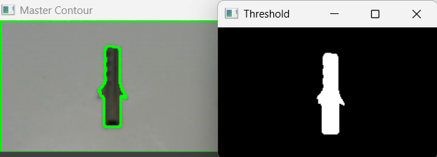
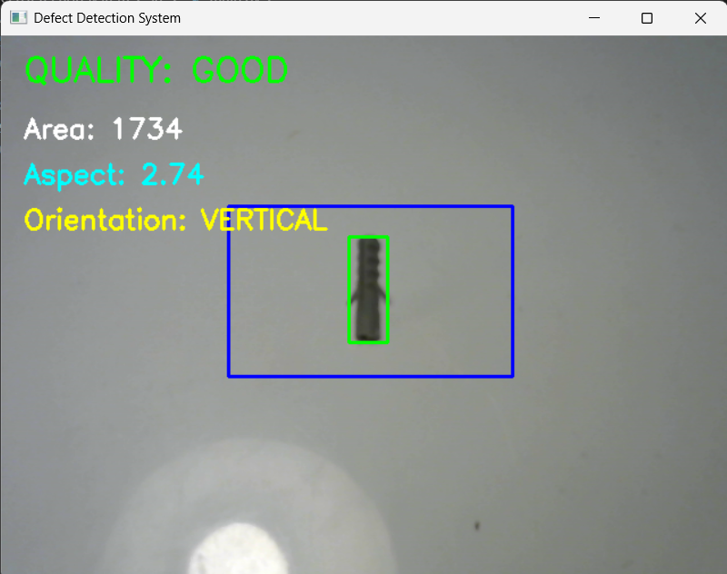
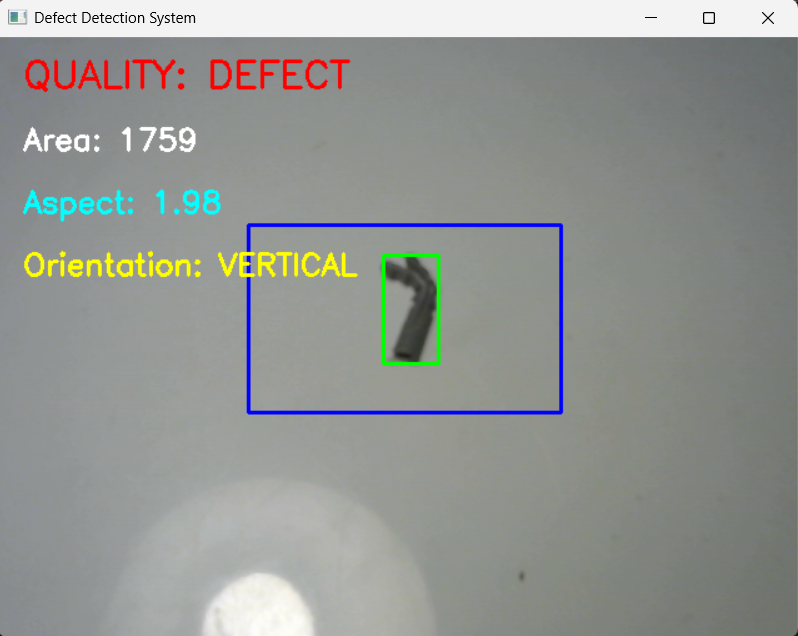

## Master Capture


# Industrial Defect Detection System
# Inspection Results

## Vertical Good Part



## Horizontal Good Part


## Vertical Defective Part


## Overview

This project implements a real-time industrial machine vision inspection system using OpenCV for automated defect detection and quality inspection.

The system captures live video from a USB camera, analyzes components within a predefined Region of Interest (ROI), and determines whether a part is GOOD or DEFECTIVE based on geometric measurements and inspection rules.

The project simulates quality control applications commonly used in manufacturing, assembly verification, machine vision inspection stations, and Industry 4.0 environments.

---

# Features

✅ Real-time camera-based inspection

✅ ROI (Region of Interest) based processing

✅ Live threshold adjustment using trackbars

✅ Presence detection

✅ Orientation detection

✅ Area measurement

✅ Aspect ratio analysis

✅ Defect classification

✅ Quality inspection logic

✅ Real-time visual feedback

✅ Industrial-style GOOD / DEFECT decision making

---

# Technologies Used

- Python
- OpenCV
- NumPy
- USB Camera
- VS Code

---

# System Workflow

```text
Camera Feed
      ↓
ROI Selection
      ↓
Grayscale Conversion
      ↓
Gaussian Blur
      ↓
Thresholding
      ↓
Contour Detection
      ↓
Feature Extraction
      ↓
Area Measurement
      ↓
Aspect Ratio Analysis
      ↓
Orientation Detection
      ↓
GOOD / DEFECT Classification
```

---

# Inspection Parameters

The system evaluates each detected component using:

### Area Inspection

The contour area of the detected object is measured and compared against predefined tolerance limits.

### Aspect Ratio Inspection

The ratio between object dimensions is calculated and used to verify shape consistency.

### Orientation Inspection

Objects are classified as:

- Horizontal
- Vertical
- Tilted

Tilted components can be identified and rejected.

---

# Defect Detection Logic

The system classifies parts using multiple inspection criteria.
## Master Capture


### GOOD Part

A part is classified as GOOD when:

- Object is present
- Area is within tolerance
- Aspect ratio is within tolerance
- Orientation is acceptable

### DEFECTIVE Part

A part is classified as DEFECTIVE when:

- Area exceeds tolerance limits
- Shape dimensions are incorrect
- Orientation is invalid
- Geometric characteristics deviate from expected values

---

# Project Structure

```text
Industrial-Defect-Detection-System
│
├── src
│   └── main.py
│
├── images
│   └── master_part.png
│
├── results
│   ├── good_vertical.png
│   ├── good_horizontal.png
│   ├── tilted_defect.png
│   ├── defective_part.png
│   └── no_part.png
│
├── demo
│   └── demo_video.mp4
│
└── README.md
```

---

# Test Objects

The system was tested using industrial-style components including:

- Wall Plugs
- Fasteners
- Small Mechanical Components

These objects were selected to simulate real manufacturing inspection scenarios.

---

# Sample Results

## GOOD Part

- QUALITY: GOOD
- Area within limits
- Aspect ratio within limits
- Correct orientation

## DEFECTIVE Part

- QUALITY: DEFECT
- Area outside tolerance
- Invalid dimensions
- Incorrect orientation

## No Part Present

- QUALITY: NO PART

---

# Applications

This project demonstrates machine vision concepts used in:

- Manufacturing Inspection
- Assembly Verification
- Defect Detection
- Quality Control
- Automated Inspection Stations
- Smart Manufacturing
- Industry 4.0 Systems
- Vision-Based Automation

---

# Skills Demonstrated

### Machine Vision

- Image Acquisition
- ROI-Based Inspection
- Thresholding
- Contour Detection
- Feature Extraction
- Real-Time Image Processing

### Industrial Inspection

- Defect Detection
- Quality Verification
- Area Analysis
- Aspect Ratio Inspection
- Orientation Classification
- Tolerance-Based Decision Making

### Software Development

- Python Programming
- OpenCV Development
- Real-Time Systems
- Industrial Automation Concepts

---

# Key Learnings

Through this project, the following concepts were explored:

- Industrial machine vision workflows
- Image preprocessing techniques
- Threshold tuning and optimization
- Geometric feature extraction
- Quality inspection logic
- Defect classification methods
- Impact of lighting on inspection performance
- Real-time vision system development

---

# Future Improvements

Planned enhancements include:

- PLC Communication (Modbus TCP)
- Conveyor-Based Inspection
- Automated Reject Mechanism
- OMRON Vision Integration
- Cognex Vision Integration
- AI-Based Defect Detection
- YOLO-Based Classification
- Vision-Guided Robotics
- Multi-Object Inspection

---

# Author

Nicholas Christo

B.Tech Computer Science Engineering (AI & ML)

Areas of Interest:

- Machine Vision
- Industrial Automation
- Robotics
- Artificial Intelligence
- Vision-Guided Systems
- Smart Manufacturing
